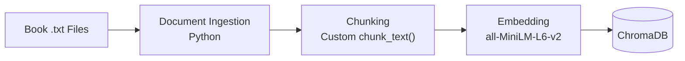

# Project 1 Planning: The Unofficial Guide

> Write this document before you write any pipeline code.
> Your spec and architecture diagram are what you'll use to direct AI tools (Claude, Copilot, etc.) to generate your implementation — the more specific they are, the more useful the generated code will be.
> Update the Retrieval Approach and Chunking Strategy sections if you change your approach during implementation.
> Update this file before starting any stretch features.

---

## Domain
[What domain did you choose? Why is this knowledge valuable and hard to find through official channels?]
Domain: A searchable library of 10 public-domain classic books.

= This knowledge is valuable because readers often remember a scene, character, or event from a book but cannot remember the exact words or where it appeared. This system helps them quickly find specific passages and understand what happened without rereading the entire book. It is hard to find through official channels because books usually only include a table of contents, not detailed indexes of events or scenes. Search engines, study guides, and summaries focus on major plot points and often cannot answer specific questions about lesser-known moments. If a reader does not remember the exact wording kind of like the Ctrl + F function, traditional text search is often ineffective. This project makes those hidden details easy to find using natural language questions.

## Documents
[List your specific sources: URLs, subreddit names, forum threads, or file descriptions. Aim for variety — sources that together cover different subtopics or perspectives within your domain.]

I used 10 public-domain books from Project Gutenberg, downloaded as plain text (.txt) files and stored locally in the documents/ folder.

The sources are:

Pride and Prejudice by Jane Austen
 https://www.gutenberg.org/ebooks/1342

The Adventures of Sherlock Holmes by Arthur Conan Doyle
 https://www.gutenberg.org/ebooks/1661

The Art of War by Sun Tzu
 https://www.gutenberg.org/ebooks/132

Alice's Adventures in Wonderland by Lewis Carroll
 https://www.gutenberg.org/ebooks/11

Moby-Dick by Herman Melville
 https://www.gutenberg.org/ebooks/2701

Frankenstein by Mary Shelley
 https://www.gutenberg.org/ebooks/84

A Tale of Two Cities by Charles Dickens
 https://www.gutenberg.org/ebooks/98

The Picture of Dorian Gray by Oscar Wilde
 https://www.gutenberg.org/ebooks/174

Dracula by Bram Stoker
 https://www.gutenberg.org/ebooks/345

Adventures of Huckleberry Finn by Mark Twain
 https://www.gutenberg.org/ebooks/76

Why these sources?
 They provide a diverse collection of classic literature, including romance, detective fiction, fantasy, horror, historical fiction, adventure, and military strategy. This variety helps test whether the system can accurately retrieve information from different books and distinguish between similar characters, themes, and events across multiple works.

## Chunking Strategy
[How will you split documents into chunks? State your chunk size (in tokens or characters), overlap size, and explain why those numbers fit the structure of your documents. A review-heavy corpus warrants different chunking than a long FAQ.]

Chunk size: ~800 characters (maximum 1,000 characters)
Overlap: 150 characters

Before chunking:

- Remove Project Gutenberg headers, footers, and license text.
Removed tables of contents to avoid duplicate chapter entries.
-Rejoine hard-wrapped lines into normal paragraphs.
-Detect chapter boundaries for each book.
- Will apply extra cleaning to The Art of War by removing editor introductions and annotations.

Documents will be split using paragraph-based, chapter-bounded approach. So, whole paragraphs are grouped until a chunk reaches about 800 characters. Chunks should never cross chapter boundaries. If a paragraph is too long, it is split at sentence boundaries. Each new chunk includes a 150-character overlap from the previous chunk.

For each chunk include:

Book title
Author
Gutenberg ID
Chapter number/title
Chunk index

I also prepend the book and chapter title to the chunk before embedding to provide additional context.

Why this approach? This is because novels are organized around chapters and paragraphs, which naturally represent scenes and ideas. Using paragraph-based chunks preserves context better than splitting text at fixed character counts. The 150-character overlap helps keep related events together and improves retrieval when characters are referenced by pronouns such as "he" or "she." Limiting chunks to about 800 characters also ensures they fit within the embedding model's input limits, making retrieval more accurate.

# Sample Chunks
==============================================================================
SOURCE   Pride and Prejudice — Jane Austen
CHAPTER  Chapter XX
CHUNK    index 364 · 721 chars · dialogue-heavy Regency prose
------------------------------------------------------------------------------
I have much pleasure, indeed, in talking to anybody. People who suffer as I do from nervous complaints can have no great inclination for talking.

Nobody can tell what I suffer! But it is always so. Those who do not complain are never pitied.”

Her daughters listened in silence to this effusion, sensible that any attempt to reason with or soothe her would only increase the irritation. She talked on, therefore, without interruption from any of them till they were joined by Mr. Collins, who entered with an air more stately than usual, and on perceiving whom, she said to the girls,--

“Now, I do insist upon it, that you, all of you, hold your tongues, and let Mr. Collins and me have a little conversation together.”

==============================================================================
SOURCE   The Art of War — Sun Tzu (translated by Lionel Giles)
CHAPTER  Chapter VI: Weak Points and Strong
CHUNK    index 47 · 736 chars · non-narrative numbered aphorisms
------------------------------------------------------------------------------
Rouse him, and learn the principle of his activity or inactivity.

Force him to reveal himself, so as to find out his vulnerable spots.

24. Carefully compare the opposing army with your own, so that you may know where strength is superabundant and where it is deficient.

25. In making tactical dispositions, the highest pitch you can attain is to conceal them;

conceal your dispositions, and you will be safe from the prying of the subtlest spies, from the machinations of the wisest brains.

26. How victory may be produced for them out of the enemy’s own tactics—that is what the multitude cannot comprehend.

27. All men can see the tactics whereby I conquer, but what none can see is the strategy out of which victory is evolved.

==============================================================================
SOURCE   Dracula — Bram Stoker
CHAPTER  Chapter XI: Lucy Westenra’s Diary
CHUNK    index 531 · 769 chars · epistolary journal entry
------------------------------------------------------------------------------
for all you’re worth, and won’t git even a growl out of me. Drive along with your questions. I know what yer a-comin’ at, that ’ere escaped wolf.”

“Exactly. I want you to give me your view of it. Just tell me how it happened; and when I know the facts I’ll get you to say what you consider was the cause of it, and how you think the whole affair will end.”

“All right, guv’nor. This ’ere is about the ’ole story. That ’ere wolf what we called Bersicker was one of three grey ones that came from Norway to Jamrach’s, which we bought off him four years ago. He was a nice well-behaved wolf, that never gave no trouble to talk of. I’m more surprised at ’im for wantin’ to get out nor any other animile in the place. But, there, you can’t trust wolves no more nor women.”

==============================================================================
SOURCE   Adventures of Huckleberry Finn — Mark Twain
CHAPTER  Chapter XVII
CHUNK    index 349 · 781 chars · phonetic vernacular dialect
------------------------------------------------------------------------------
tell him—oh, here he is himself. Buck, take this little stranger and get the wet clothes off from him and dress him up in some of yours that’s dry.”

Buck looked about as old as me—thirteen or fourteen or along there, though he was a little bigger than me. He hadn’t on anything but a shirt, and he was very frowzy-headed. He came in gaping and digging one fist into his eyes, and he was dragging a gun along with the other one. He says:

“Ain’t they no Shepherdsons around?”

They said, no, ’twas a false alarm.

“Well,” he says, “if they’d a ben some, I reckon I’d a got one.”

They all laughed, and Bob says:

“Why, Buck, they might have scalped us all, you’ve been so slow in coming.”

“Well, nobody come after me, and it ain’t right I’m always kept down; I don’t get no show.”

==============================================================================
SOURCE   Moby-Dick; or, The Whale — Herman Melville
CHAPTER  Chapter 42: The Whiteness of the Whale
CHUNK    index 700 · 844 chars · long-form narrative and digression
------------------------------------------------------------------------------
at all approaching to muteness or universality. What I mean by these two statements may perhaps be respectively elucidated by the following examples.

First: The mariner, when drawing nigh the coasts of foreign lands, if by night he hear the roar of breakers, starts to vigilance, and feels just enough of trepidation to sharpen all his faculties; but under precisely similar circumstances, let him be called from his hammock to view his ship sailing through a midnight sea of milky whiteness—as if from encircling headlands shoals of combed white bears were swimming round him, then he feels a silent, superstitious dread; the shrouded phantom of the whitened waters is horrible to him as a real ghost; in vain the lead assures him he is still off soundings; heart and helm they both go down; he never rests till blue water is under him again.

## Retrieval Approach
[Which embedding model are you using (e.g., all-MiniLM-L6-v2 via sentence-transformers)? How many chunks will you retrieve per query (top-k)? If you were deploying this for real users and cost wasn't a constraint, what tradeoffs would you weigh in choosing a different embedding model — context length, multilingual support, accuracy on domain-specific text, latency?]

Embedding model: all-MiniLM-L6-v2 from the sentence-transformers library.

Top-k retrieval: 12 chunks per query, with a distance threshold of 0.51 to filter out weak matches.

Vector database: ChromaDB (chroma_db/).

Update during implementation — why top-k changed from 5 to 12:
 I originally planned to retrieve 5 chunks. When I ran my five evaluation questions, only 2 of them could be answered. The other 3 failed in the same way: the passage holding the answer existed and was ranked reasonably, but sat just outside a window of 5. Frankenstein chapter 5 ranks 8th and Pride and Prejudice chapter XXXIV ranks 12th, so a top-5 window excluded both. Raising the window to 12 brought them in.

 The limit on how far I can raise it is not the model's context window, which is 131,000 tokens. It is Groq's free tier, which allows 8,000 tokens per minute. Each passage costs roughly 215 tokens, so 12 passages plus the system prompt comes to about 3,000 tokens per question. I tried retrieving whole chapters instead of chunks and the request was rejected with a 413 error at around 13,000 tokens, which is what told me where the real ceiling is.

Update during implementation — how the 0.51 threshold was chosen:
 I did not pick this number by guessing. I added a --calibrate mode to embed.py that runs my five evaluation questions alongside five clearly out-of-scope questions and prints the distance of the closest match for each. The in-scope questions scored between 0.214 and 0.337. The out-of-scope questions scored between 0.684 and 0.821. That leaves a clean gap of 0.348 with no overlap, and 0.51 sits in the middle of it. Because the two groups separate so cleanly, the system refuses out-of-scope questions before calling the language model at all.

Why I chose it:
 I selected all-MiniLM-L6-v2 because it is free, runs locally on a CPU, and can efficiently embed the entire collection, which came to 10,301 text chunks. Retrieving the top 12 chunks provides enough context to answer questions accurately without overwhelming the language model with irrelevant passages. The distance threshold also helps the system avoid answering questions that are not supported by the book collection.

Tradeoffs for a production system:
 If cost were not a concern, I would primarily consider:

Context length: Larger embedding models can encode much longer passages, allowing entire scenes or chapters to be embedded together rather than splitting them into smaller chunks. This would preserve more context and improve retrieval quality.
Accuracy on literary text: A more advanced model may better understand older writing styles, dialects, historical language, and literary references found in books such as Moby-Dick, Pride and Prejudice, and Huckleberry Finn.
Latency: Larger models generally provide better retrieval accuracy but increase processing time and infrastructure requirements compared to a lightweight model like MiniLM.
Multilingual support: While not important for this project because all sources are in English, multilingual models would be valuable if the collection included books in multiple languages.

For this project, all-MiniLM-L6-v2 offers the best balance of speed, simplicity, and retrieval performance.

## Evaluation Plan
[List your 5 test questions with their expected correct answers. Questions should be specific enough that you can judge whether the system's response is right or wrong — "What are good dining halls?" is too vague; "What do students say about wait times at the [dining hall name] during lunch?" is testable.]]
Test Questions and Expected Answers

I selected five questions that test different retrieval abilities, including finding specific passages, summarizing information across multiple passages, and handling older literary language.

In Pride and Prejudice, why does Elizabeth reject Darcy's first proposal?
 Expected answer: Elizabeth refuses because she believes Darcy separated Bingley from Jane, treated Wickham unfairly, and proposed in a way that insulted her family and social status.

In Frankenstein, how does Victor react when the creature comes to life?
 Expected answer: Instead of feeling proud, Victor is horrified by what he has created. He feels disgust and fear, leaves the room, and abandons the creature.

Who is Irene Adler, and why is she important to Sherlock Holmes?
 Expected answer: Irene Adler is the woman who successfully outsmarts Holmes in A Scandal in Bohemia. Holmes respects her greatly and refers to her as "the woman" because she defeated him.

Who is Renfield in Dracula?
 Expected answer: Renfield is a patient in Dr. Seward's asylum who has a strange obsession with consuming living creatures. He is connected to Dracula and plays an important role in revealing Dracula's influence.

Why does Huck decide not to betray Jim in Huckleberry Finn?
 Expected answer: Huck chooses friendship and loyalty over society's expectations. He tears up the letter that would reveal Jim's location and decides to help him, even believing he may be doing something wrong.

Negative query:
 "What is the best pizza restaurant in Chicago?"

Expected behavior:
 The system should refuse to answer or redirect the question because the question is unrelated to any of the books.

## Anticipated Challenges
[What could go wrong? Consider: noisy or inconsistent documents, missing source attribution, off-topic retrieval, chunks that split key information across boundaries. Name at least two specific risks.]

Potential Risks and Challenges

Coreference and character references
 In novels, characters are often introduced by name and then referred to only as "he," "she," or similar pronouns. If a chunk contains only pronouns and not the character's name, the retrieval system may struggle to connect the query with the correct passage.

Possible solution: Add book and chapter information to each chunk and use overlapping text between chunks to preserve context.

Cross-book confusion
 Some books in the collection share similar themes, settings, or writing styles. For example, Dracula, Frankenstein, and The Picture of Dorian Gray all contain gothic elements. The system may retrieve passages from the wrong book when a query is vague or ambiguous.

Possible solution: Store and display source information (book title, chapter, author) with every retrieved result and optionally allow users to filter by book.

Questions that require information from many parts of a book
 Some questions, such as "Who is Renfield?" require details gathered from multiple chapters rather than a single passage. Retrieving only a few top chunks may produce an incomplete answer.

Possible Solution: Retrieve multiple relevant chunks and combine evidence from different locations before generating a response.

Chunk boundary issues
 Important information may be split across two chunks, causing the system to miss key context or retrieve only part of an event.

Possible Solution: Use overlapping chunks and split text at paragraph or sentence boundaries instead of fixed positions.

Differences in document structure
 The corpus contains many types of texts, including novels, short-story collections, and The Art of War, which is a collection of short aphorisms. A chunking strategy that works well for novels may not be ideal for every source.

Possible Solution: Apply source-specific preprocessing and adjust chunking rules when needed for different document types.

## Architecture

The system would have two phases: Indexing (performed once to build the database) and Querying (performed each time a user asks a question).

Indexing Phase

Querying Phase

Tools Used

| Stage | Tool / Library |
|---|---|
| Document Ingestion | Python (`pathlib`, `re`) |
| Chunking | Custom `chunk_text()` function |
| Embedding | sentence-transformers (all-MiniLM-L6-v2) |
| Vector Store | ChromaDB |
| Retrieval | ChromaDB similarity search |
| Generation | `openai/gpt-oss-120b` via Groq API |
| Interface | Gradio |

Overview: The books are cleaned, split into chunks, embedded, and stored in ChromaDB. When a user asks a question, the question is embedded, the top 12 relevant chunks are retrieved, and `openai/gpt-oss-120b` generates an answer using only those retrieved passages, along with the book and chapter source information.

## AI Tool Plan
[Which parts of the pipeline do you plan to use AI tools (Claude, Copilot, ChatGPT, etc.) to help you implement? For each part, describe what you'll give the AI as input — which sections of this planning.md, which requirements from the instructions — and what you expect it to produce. Be specific: "I'll prompt Claude with my chunking strategy section and ask it to implement the chunk_text() function" is a plan. "I'll use AI to help me code" is not.]

I am using **Claude (Claude Code in VS Code)** as the primary tool, because it can read the actual corpus files while generating code rather than working from my description of them. That already changed this plan: I asked it to inspect the ten files before writing the Chunking Strategy, and it found the duplicated table of contents (TOC) problem and the Lionel Giles issue in *The Art of War*, neither of which I knew about. Both are now preprocessing steps.

